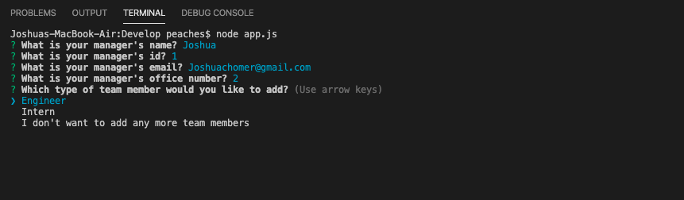
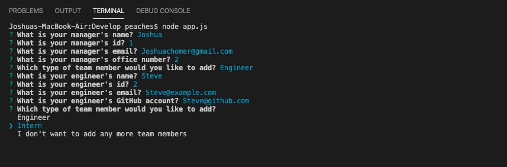
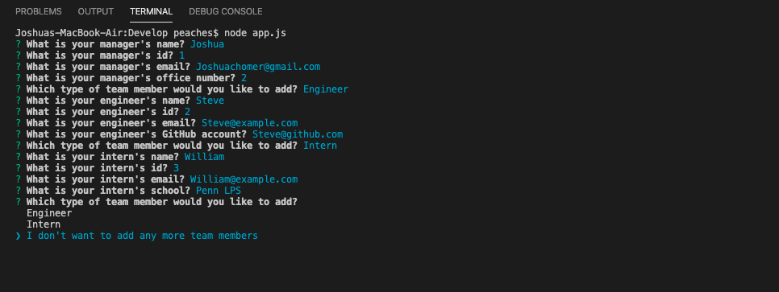
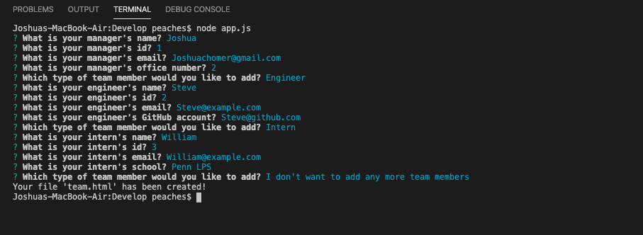
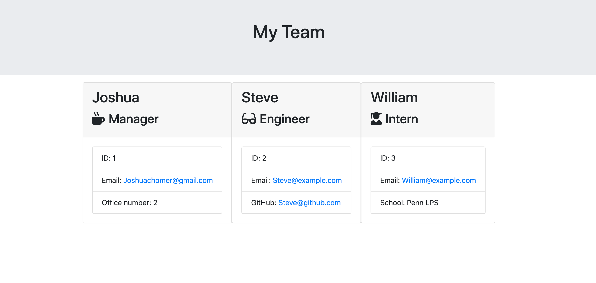
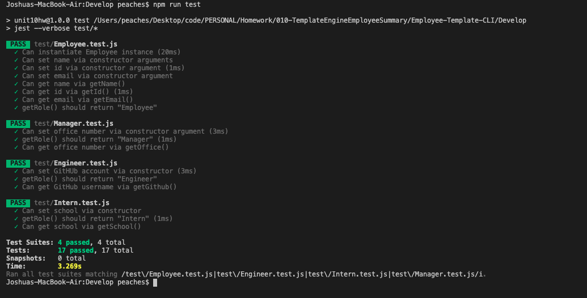

# Employee Template CLI

## About

This command line application assignment is designed to create an html page, to display summaries of each member in a software engineer team. This will allow specific information to be displayed for each team member, based on their specific role.

The "team" will consist of one Manager, and unlimited Engineers and Interns. To start the program, just simply run "node app.js" in the command line. The user will be prompted using inquirer, to enter information about the Manager of the team. Upon answering the prompted questions, the user chooses whether they want to add an Intern, Engineer, or finalize their team. After all the Interns/Engineers are included, the html file will be automatically generated as "team.html".

I was provided with the html template, code to render the responses and nmp test code. The finished product needed to pass all 17 tests, as well as rendering an acceptable html file.

I used a class for "Employee", which contains the constructor for "name, id, email" - because every employee needs that information. I extended the class for Manager, Intern and Engineer, to obtain the information specific to the role.

## Contributors

* [Joshua Homer](https://github.com/Jchomer90)

## User Experience

* <a href="https://drive.google.com/file/d/1pPB9MHhdutbQTIHDY4yi3k_Pn5Buxk7I/view">Video</a>

### Run 'node app.js', fill out manager information

### Select 'Engineer'

### Select 'Intern'

### Select 'I don't want to add any more team members'

### Automatically generated HTML

### Pass npm tests
